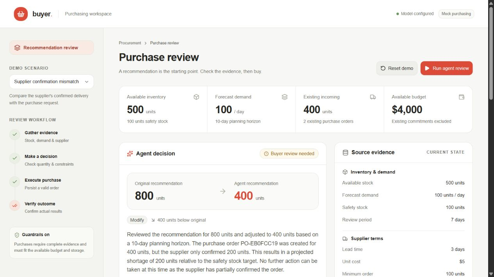
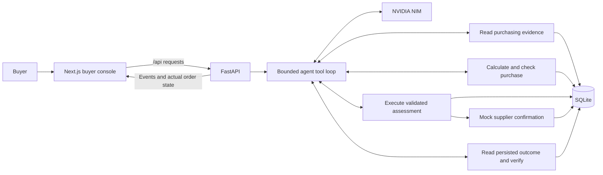

# AI buyer agent

A buyer console that investigates an 800-unit purchase recommendation, executes a supported decision, and checks the supplier's actual response. The main scenario needs 400 units. A second run demonstrates what happens when the supplier confirms only half the order.

The demo covers recommendation review, budget and storage constraints, purchase execution, and post-action validation. All supplier and inventory operations use seeded mock data. NVIDIA NIM runs live; provider errors remain visible.



The [captured demo](docs/demo.md#captured-live-run) preserves a pre-migration Gemini supplier-shortfall walkthrough and its actual tool transcript. The [measured results](docs/evaluation.md#results) distinguish passing application checks from provider outages during broader live evaluation.

## Run locally

Use Node.js 24, pnpm 11.10.0, Python 3.11 or newer, and uv. The application uses Next.js on port 3000 and FastAPI on loopback port 8000.

```sh
git clone https://github.com/vishnud05/rappi-poc.git
cd rappi-poc
pnpm install --frozen-lockfile
uv sync --locked
```

Copy [.env.example](.env.example) to `.env` and set `NVIDIA_API_KEY`. Use `Copy-Item .env.example .env` in PowerShell or `cp .env.example .env` on macOS/Linux. Keep `.env` private. Do not put the key in a `NEXT_PUBLIC_` variable.

Start the backend from the repository root:

```sh
uv run --env-file .env uvicorn backend.main:app --host 127.0.0.1 --port 8000
```

Use one backend worker. SQLite enforces one active run; startup recovery assumes one application process owns it. If the variables are already set in your shell, omit `--env-file .env`.

Start the frontend from a second terminal in the repository root:

```sh
pnpm dev
```

Open [the buyer console](http://127.0.0.1:3000). Restart Next.js after changing `BACKEND_URL`.

For a production frontend build, run `pnpm build` and then `pnpm start` while the backend stays running.

| Variable | Default | Purpose |
| --- | --- | --- |
| `NVIDIA_API_KEY` | Required for live runs | Server-side NVIDIA API Catalog credential |
| `NVIDIA_MODEL` | `meta/llama-3.3-70b-instruct` | NVIDIA NIM model used for purchasing runs |
| `DATABASE_PATH` | `data/purchasing.db` | Local SQLite state |
| `BACKEND_URL` | `http://127.0.0.1:8000` | Server-only Next.js API proxy target |

See the [demo walkthrough](docs/demo.md) and [evaluation protocol](docs/evaluation.md).

## Check the implementation

Run these commands from the repository root:

```sh
uv run python -m unittest discover -s backend/tests -v
pnpm test:frontend
pnpm typecheck
pnpm lint
pnpm build
```

Run live model evaluation with your configured credential:

```sh
uv run --env-file .env python -m backend.evaluate --output docs/evaluation-results.json
```

Evaluation spaces case starts by at least 65 seconds and stops if the provider reports quota exhaustion. To check one case first, add `--scenario review-800`. It uses a temporary database and leaves the interactive demo state unchanged. The [evaluation report](docs/evaluation.md) records measured results separately from expectations.

## How it works



The agent uses tools to inspect stock and incoming orders, demand, supplier terms, and constraints. It then chooses `accept`, `modify`, `reject`, or `investigate` and explains the evidence behind that choice.

The assessment tool calculates the required purchase and checks delivery timing, minimum order, pack size, budget, and capacity. The purchase tool accepts an assessment identifier. It derives price and order fields from trusted records and rechecks constraints before writing. The model cannot supply an arbitrary price or bypass missing evidence.

After a purchase attempt, independent verification rereads the persisted order and supplier confirmation. It recomputes spend, supply coverage, and capacity. A run can report a successful purchase only when verification passes. Partial confirmation leaves the unfulfilled need visible and ends as `needs_review`.

Orders, budget changes, runs, and audit events persist in SQLite. A server-issued idempotency key prevents duplicate purchases and budget deductions. If creation times out after commit, lookup recovers the existing order before another write.

## Purchasing policy

The planning horizon is supplier lead time plus seven review days. New units required are forecast demand over that horizon, plus safety stock, minus usable stock and confirmed incoming units arriving within the horizon. Positive requirements round up to minimum-order and pack-size rules.

For the main fixture:

```text
Horizon       = 3-day lead time + 7-day review period = 10 days
Purchase need = 100/day * 10 + 100 safety stock - 500 stock - 200 incoming
              = 400 units
New spend     = 400 * $5 = $2,000
```

The original recommendation is 800 units. The fixture has a $5,000 remaining budget, 1,500-unit storage capacity, a 100-unit minimum order, and 50-unit packs.

Scenario time is fixed. Day 1 is the next simulated day; receipts arrive before daily demand. The assessment simulates stock by day to detect stockouts before delivery and peak storage occupancy. Late or unconfirmed receipts do not reduce the purchase requirement.

Remaining budget already excludes existing commitments. Money is stored as integer cents and inventory as integer units. A partial supplier confirmation is final for that mock order, so only confirmed units consume budget and count as incoming supply. Confirming 200 of 400 units commits $1,000 and leaves a 200-unit shortage.

Missing evidence, a stockout before supplier delivery, or insufficient budget or storage blocks automatic purchase. The agent must identify the unresolved issue for a buyer. It does not claim success for an incomplete purchase.

## Design choices

- Next.js, TypeScript, Tailwind CSS, and shadcn/ui provide the console. Native `fetch`, React state, and one-second polling cover run progress without an additional state or streaming library.
- FastAPI and Pydantic keep the API and input checks close to the purchasing tools. Standard-library SQLite provides atomic persistence without an ORM or separate database service.
- A small manual NVIDIA NIM tool loop uses the provider's OpenAI-compatible Chat Completions API. It keeps evidence, actions, and feedback visible and allows at most 12 model turns and 120 seconds per run. `meta/llama-3.3-70b-instruct` is the default because NVIDIA documents function-calling support for it. Set `NVIDIA_MODEL` to choose another NIM model with tool support; the application never silently switches models.
- Deterministic calculations and execution checks own purchasing constraints. Model judgment remains useful for investigating evidence and explaining the decision.
- One active run is allowed globally. Reset during an active run returns a conflict. This fits a local single-buyer demo and avoids a job queue.

## API

The browser uses `/api/*`; Next.js proxies these requests to FastAPI. The complete response shapes are in the [implementation contract](docs/contract.md).

| Endpoint | Behavior |
| --- | --- |
| `GET /api/health` | Report model configuration without exposing credentials |
| `GET /api/scenarios` | List seeded scenarios |
| `GET /api/scenarios/{id}` | Read source data and persisted purchase orders |
| `POST /api/runs` | Start a run from `{ "scenario_id": "review-800" }`; return HTTP 202 |
| `GET /api/runs/{id}` | Read progress, audit events, decision, order, and validation |
| `POST /api/scenarios/{id}/reset` | Restore the selected scenario |

Concurrent starts and resets during an active run return HTTP 409. Terminal run states are `validated`, `needs_review`, and `failed`. The UI presents errors and review requirements with the evidence collected so far.

## Delivery milestones

| Deliverable | Acceptance condition |
| --- | --- |
| Inspect a purchasing situation | Scenario data loads; live model can read evidence through a tool |
| Review the recommendation | Agent changes 800 to 400 using the supplied evidence |
| Execute and validate | One 400-unit order persists and independently verifies |
| Handle failures and constraints | Shortfalls are visible; blocked purchases preserve state; retries avoid duplicates |
| Demonstrate correctness | Policy tests, live evaluation, frontend checks, and browser flow complete |
| Submit the assignment | Source, setup, architecture, mock data, evaluation, and working demo are reproducible |

## Limits

This is a local proof of concept for one buyer, fulfillment node, product, and supplier. There is no authentication, hosted deployment, approval routing, alternate-supplier sourcing, or forecast-change workflow. Do not expose the unauthenticated backend publicly. Real supplier integration would also need reconciliation for confirmations that change after a run finishes.

Live runs require a working model credential and provider availability. There is no scripted fallback. The [evaluation report](docs/evaluation.md) separates deterministic checks from model results and records failures.

The public submission excludes local credentials, SQLite runtime state, and the private assignment PDF. Preserve the repository's incremental Git history when sharing it.
