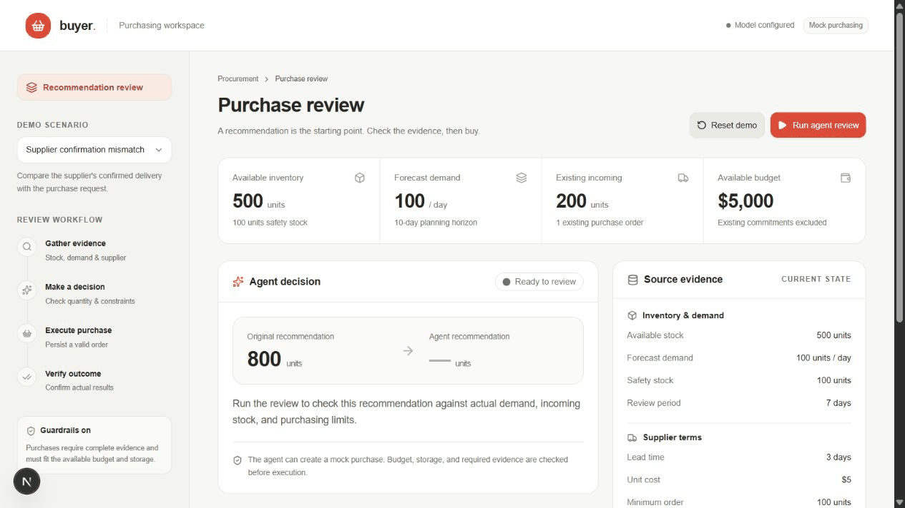

# Buyer agent demo

The demo uses mock purchasing data and a live Gemini agent. Model output may vary; quantities, state changes, and validation determine whether a run is correct.

## Captured live run

This time-compressed walkthrough uses screenshots captured at checkpoints during a real Gemini 3.1 Flash-Lite run. It shows investigation, a 400-unit request, a 200-unit confirmation, and the resulting buyer-review requirement. It is a recording of observed application states, not a scripted model fallback.

Inspect the [complete shortfall tool transcript](demo-assets/shortfall-live-run.json), [successful main-run transcript](demo-assets/main-live-run.json), or [validation screenshot](demo-assets/shortfall-validation.png). The main run used Gemini 2.5 Flash before its daily quota was exhausted. The browser runs and broader evaluation attempts are described in the [results](evaluation.md#results).

## Before presenting

1. Follow the setup and run instructions in the [README](../README.md).
2. Confirm the backend reports a configured model and the console loads the scenario data.
3. Reset the selected scenario before each run. Reset is unavailable while a run is active.

## Correct the recommendation

Select the main review scenario with the original recommendation of 800 units. Show the source data before starting the agent.

The fulfillment node has 500 units, expects 200 on day 2, and sells 100 per day. The supplier delivers in three days; the review period adds seven days. Safety stock is 100 units.

The required purchase is `100 * (3 + 7) + 100 - 500 - 200 = 400` units. The minimum order and pack size allow 400 units. At $5 per unit, the new commitment costs $2,000.

Start the run and inspect the event timeline. The agent must read stock and incoming shipments, demand, supplier terms, and constraints before executing a purchase. Its assessment should modify the recommendation from 800 to 400.

Show the persisted order and the independent verification. A successful result confirms 400 units, deducts $2,000 once, meets the demand and safety-stock requirement, and stays within storage capacity. The console must show the actual order outcome, not only the agent's intention.

## Detect a supplier shortfall

Select and reset the supplier-shortfall scenario. Run the agent against the same purchasing need.

The supplier confirms only 200 of the requested 400 units. Show the requested and confirmed quantities separately. The backend commits $1,000 for the confirmed units and recalculates supply using those 200 units. Verification identifies a 200-unit shortage and ends with human review required.

This is the feedback loop to emphasize: the agent receives the result of its action, and the application checks whether that action solved the purchasing need. An accepted tool call is not sufficient evidence of success.

## Explain the design

- Gemini chooses which evidence to inspect and explains its decision. Deterministic Python code owns quantities, prices, constraints, and purchase validation.
- SQLite stores the run, evidence events, order, and budget change. Idempotency prevents duplicate orders after a retry.
- Next.js renders source data and actual backend state. API keys remain in the backend.
- When evidence is missing or constraints prevent a complete purchase, the agent stops and identifies the buyer intervention required.

Finish with the [evaluation protocol and measured results](evaluation.md). Show the recorded backup only as a labeled recording of an earlier live run. A missing key or provider failure must remain visible; there is no scripted substitute for the agent.
